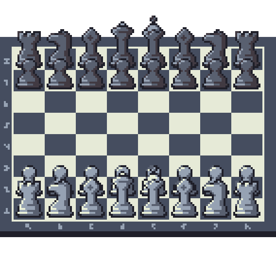

# Consensus Chess

A new way to play distributed, consensus games across federated social networks.



## Project status

Consensus Chess has reached MVP. It can launch and manage simple move-lock* games.

_*When a player participates in a game, they are then locked to the side that they move for._

## Documentation

* [Architecture](docs/architecture.md)
* [Accounts](docs/accounts.md)
* [Commands](docs/commands.md)
* [Config](docs/config.md)
* [Database](docs/database.md)
* [Rate limits](docs/rate-limits.md)
* [Testing](docs/testing.md)

### Attribution

* [Credits](docs/credits.md)
* [Dependencies](docs/dependencies.md)

### Blog posts

* [International Consensus Games](https://instantiator.dev/post/consensus-games/) (explainer)

### Roadmap

* [Consensus chess 2022](https://trello.com/b/r0OX2iCq/consensus-chess-2022) (Trello board)

## Prerequisites

* [Docker](https://www.docker.com/products/docker-desktop/)

## Getting started

1. Set up some Mastodon accounts, and developer apps for each account, as described in: [accounts](docs/accounts.md)
2. Add config files to `environments` directory, as described in: [config](docs/config.md)
  * for each engine and node
  * for the integration testing service
  * For each database instance
3. Launch your choice of environment...

eg. Launch and run the feature tests:

```shell
./feature-tests.sh
```

or, eg. Launch and run all containers for the `int` environment:

```shell
./run.sh -e int
```


## Environments

| Environment | Name | Description |
|-|-|-|
| `int` | Integration | Runs a non-production postgres database instance. Nodes attach to non-production social media accounts. |
| `prod` | Production | Nodes attach to social media production accounts, and a production postgres database instance. |

## Scripts

### Testing scripts

The following scripts will launch and run tests for you in containers:

| Script | Description |
|-|-|
| `feature-tests.sh` | Launches the feature tests in a single container, with supporting sqlite db and mocked social network connections. Runs the unit tests during build. |
| `integration-tests.sh` | Launches the db, engine, a node, and the integration test runner for the `int` environment. Runs the unit and feature tests during build. |

See the [testing documentation](docs/testing.md) for more information about these tests.

### Common operation scripts

The following scripts exist for common operations:

| Script | Description |
|-|-|
| `run.sh` | Launches the db, engine and all nodes defined for environment specified. Runs the unit and feature tests during build. |
| `start-db.sh` | Starts the database (only) for the environment specified. |
| `stop.sh` | Stop all running containers in the environment specified. |
| `erase.sh` | Use carefully! This clears down your docker compose project - erasing all containers and volumes for the environment specified. |

If you don't provide any parameters, these scripts will halt and display their parameter options.

### Environment parameter

For the common operation scripts, you must specify the environment with the `-e` or `--environment` option.

Choices of environment: `int`, `prod`

eg.

```shell
./run.sh --environment int
```

### Run in background

The `run.sh` and `start-db.sh` scripts can run your services in the background. Set the `-d` or `--detach` option.

eg.

```shell
./run.sh --environment prod --detach
```
