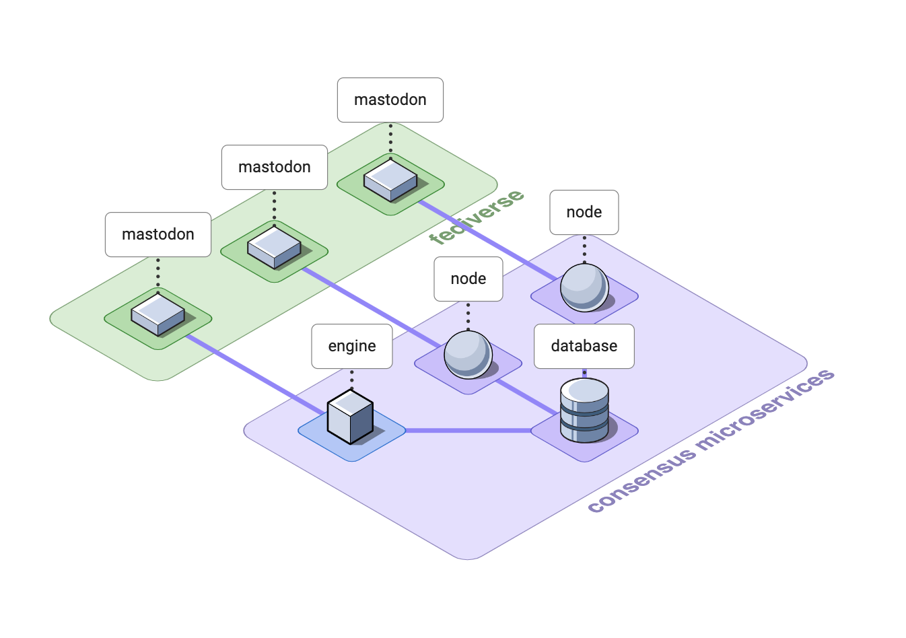

# consensus-chess-engine

A new way to play distributed, consensus games across federated social networks.

_NB. This is a work in progress - the engine is not yet ready to host games._



## Documentation

* [Architecture](docs/architecture.md)
* [Accounts](docs/accounts.md)
* [Commands](docs/commands.md)
* [Config](docs/config.md)
* [Database](docs/database.md)
* [Dependencies](docs/dependencies.md)
* [Testing](docs/testing.md)

### Blog posts

* [International Consensus Games](https://instantiator.dev/post/consensus-games/) (explainer)

### Roadmap

* [Consensus chess 2022](https://trello.com/b/r0OX2iCq/consensus-chess-2022) (Trello board)

## Prerequisites

* [Docker](https://www.docker.com/products/docker-desktop/)

## Getting started

1. Set up some Mastodon accounts, and developer apps for each account, as described in: [accounts](docs/accounts.md)
2. Add config files to `environments` directory, as described in: [config](docs/config.md)
  * for each engine and node
  * for the integration testing service
  * For each database instance
3. Launch and run integration tests with: `./integration-tests.sh` (also runs unit tests during build)

  

## Scripts

The following scripts exist for common operations:

| Script | Description |
|-|-|
| `integration-tests.sh` | Launches the db, engine, a node, and the integration test runner for the `int` environment. |
| `run.sh` | Launches the db, engine and all nodes defined for environment specified. |
| `start-db.sh` | Starts the database (only) for the environment specified. |
| `stop.sh` | Stop all running containers in the environment specified. |
| `erase.sh` | Use carefully! This clears down your docker compose project - erasing all containers and volumes for the environment specified. |

If you don't provide any parameters, all scripts except `integration-tests.sh` will halt and display their parameter options.

### Environment

For all except the `integration-tests.sh` script, you must specify the environment with the `-e` or `--environment` option.

Choices of environment: `int`, `prod`

eg.

```shell
./run.sh --environment int
```

### Run in background

The `run.sh` and `start-db.sh` scripts can run your services in the background. Set the `-d` or `--detach` option.

eg.

```shell
./run.sh --environment prod --detach
```
