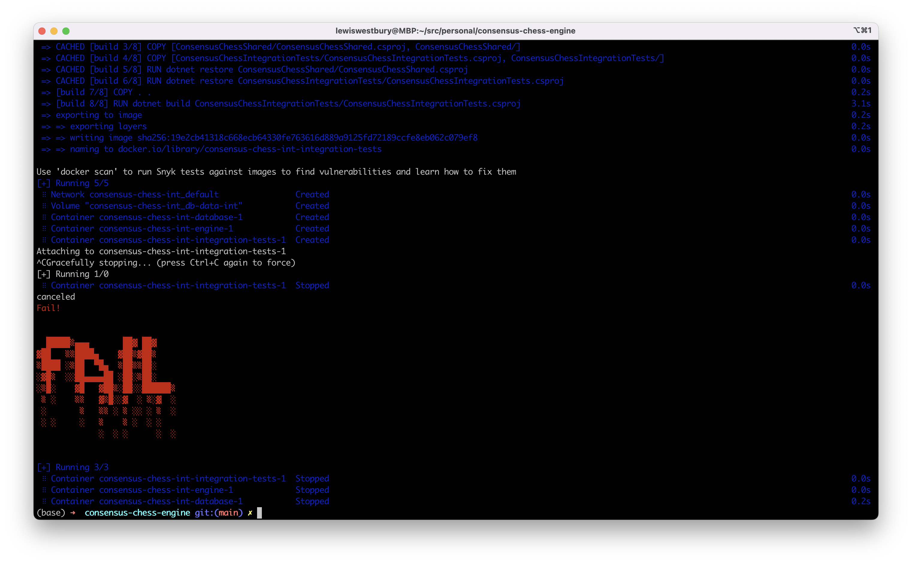

# Testing

## Unit tests

Unit tests are defined in the `ConsensusChessSharedTests` project.

The tests can be run manually through the terminal, or Visual Studio:

```shell
dotnet test ConsensusChessSharedTests/ConsensusChessSharedTests.csproj
```

Both `ConsensusChessEngine/Dockerfile` and `ConsensusChessNode/Dockerfile` also run the unit tests during build.

If the unit tests fail, the build will fail. This will effectively prevent deployment of a solution with any failing tests.

## Integration tests

Integration tests are defined in the `ConsensusChessIntegrationTests` project. These tests require access to an operational integration instance, with a database, engine, and at least 1 node.

It has access to the `int` database, and a social network identity of its own. It can monitor the database, post messages and check for engine and node behaviours.

The `integration-tests.sh` script will launch all integration environment services, and trigger the integration tests. If the tests fail, the script will return a non-zero code and visually indicate its state.

| Fail | Pass |
|-|-|
|  |  |

### Investigating

If something fails, often the logs of individual services will give a clue as to why. These are retained by docker.

